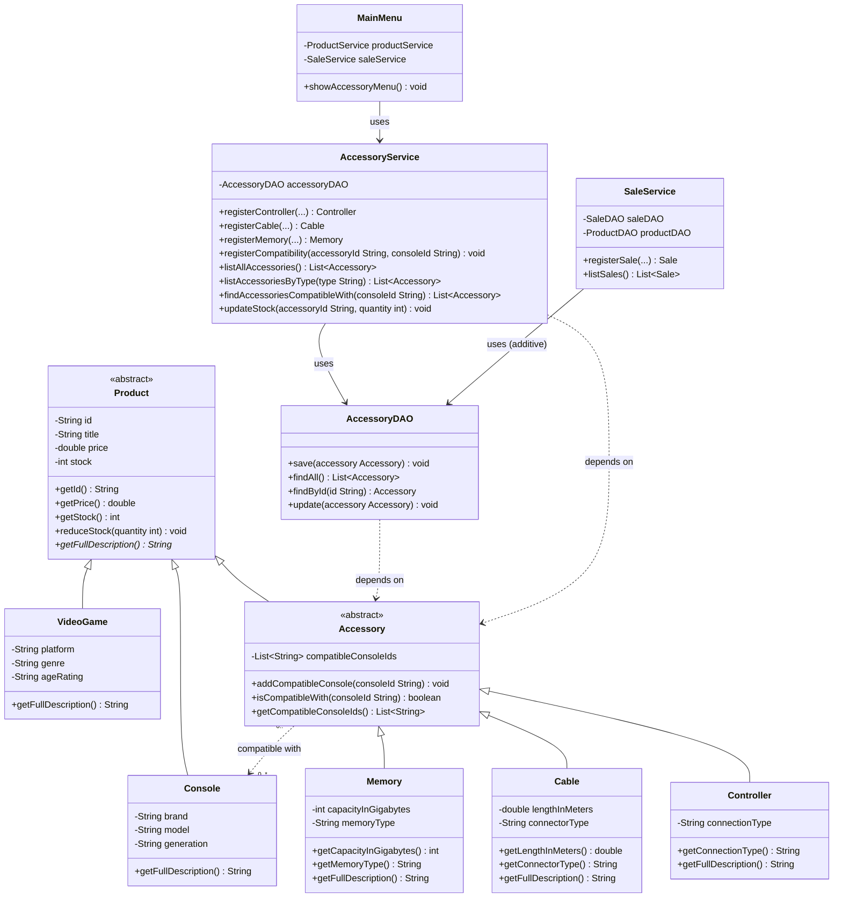

# Accessory Module - Class Diagram

```mermaid
classDiagram
    %% ===================== EXISTING MODEL LAYER (for context) =====================
    class Product {
        <<abstract>>
        -String id
        -String title
        -double price
        -int stock
        +getId() String
        +getPrice() double
        +getStock() int
        +reduceStock(quantity int) void
        +getFullDescription()* String
    }

    class Console {
        -String brand
        -String model
        -String generation
        +getFullDescription() String
    }

    class VideoGame {
        -String platform
        -String genre
        -String ageRating
        +getFullDescription() String
    }

    %% ===================== NEW MODEL LAYER =====================
    class Accessory {
        <<abstract>>
        -List~String~ compatibleConsoleIds
        +addCompatibleConsole(consoleId String) void
        +isCompatibleWith(consoleId String) boolean
        +getCompatibleConsoleIds() List~String~
    }

    class Controller {
        -String connectionType
        +getConnectionType() String
        +getFullDescription() String
    }

    class Cable {
        -double lengthInMeters
        -String connectorType
        +getLengthInMeters() double
        +getConnectorType() String
        +getFullDescription() String
    }

    class Memory {
        -int capacityInGigabytes
        -String memoryType
        +getCapacityInGigabytes() int
        +getMemoryType() String
        +getFullDescription() String
    }

    %% ===================== NEW PERSISTENCE LAYER =====================
    class AccessoryDAO {
        +save(accessory Accessory) void
        +findAll() List~Accessory~
        +findById(id String) Accessory
        +update(accessory Accessory) void
    }

    %% ===================== NEW SERVICE LAYER =====================
    class AccessoryService {
        -AccessoryDAO accessoryDAO
        +registerController(...) Controller
        +registerCable(...) Cable
        +registerMemory(...) Memory
        +registerCompatibility(accessoryId String, consoleId String) void
        +listAllAccessories() List~Accessory~
        +listAccessoriesByType(type String) List~Accessory~
        +findAccessoriesCompatibleWith(consoleId String) List~Accessory~
        +updateStock(accessoryId String, quantity int) void
    }

    %% ===================== EXISTING SERVICE LAYER (for context) =====================
    class SaleService {
        -SaleDAO saleDAO
        -ProductDAO productDAO
        +registerSale(...) Sale
        +listSales() List~Sale~
    }

    class MainMenu {
        -ProductService productService
        -SaleService saleService
        +showAccessoryMenu() void
    }

    %% ===================== RELATIONSHIPS =====================
    Product <|-- Console
    Product <|-- VideoGame
    Product <|-- Accessory
    Accessory <|-- Controller
    Accessory <|-- Cable
    Accessory <|-- Memory

    Accessory "0..*" ..> "0..*" Console : compatible with

    AccessoryDAO ..> Accessory : depends on
    AccessoryService --> AccessoryDAO : uses
    AccessoryService ..> Accessory : depends on

    SaleService --> AccessoryDAO : uses (additive)
    MainMenu --> AccessoryService : uses
```