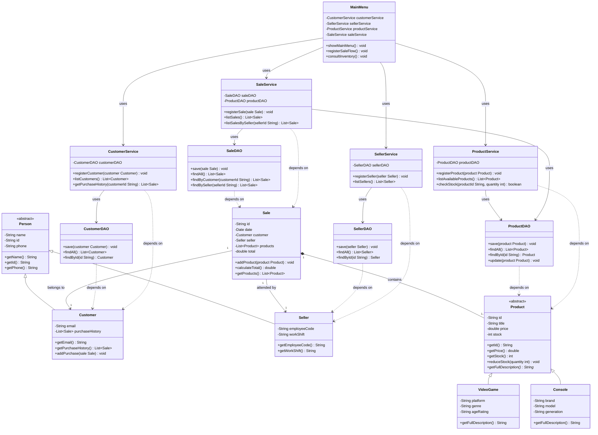

# Class Diagram

```mermaid
classDiagram
    %% ===================== MODEL LAYER =====================
    class Person {
        <<abstract>>
        -String name
        -String id
        -String phone
        +getName() String
        +getId() String
        +getPhone() String
    }

    class Customer {
        -String email
        -List~Sale~ purchaseHistory
        +getEmail() String
        +getPurchaseHistory() List~Sale~
        +addPurchase(sale Sale) void
    }

    class Seller {
        -String employeeCode
        -String workShift
        +getEmployeeCode() String
        +getWorkShift() String
    }

    class Product {
        <<abstract>>
        -String id
        -String title
        -double price
        -int stock
        +getId() String
        +getPrice() double
        +getStock() int
        +reduceStock(quantity int) void
        +getFullDescription()* String
    }

    class VideoGame {
        -String platform
        -String genre
        -String ageRating
        +getFullDescription() String
    }

    class Console {
        -String brand
        -String model
        -String generation
        +getFullDescription() String
    }

    class Sale {
        -String id
        -Date date
        -Customer customer
        -Seller seller
        -List~Product~ products
        -double total
        +addProduct(product Product) void
        +calculateTotal() double
        +getProducts() List~Product~
    }

    %% ===================== PERSISTENCE LAYER =====================
    class CustomerDAO {
        +save(customer Customer) void
        +findAll() List~Customer~
        +findById(id String) Customer
    }

    class SellerDAO {
        +save(seller Seller) void
        +findAll() List~Seller~
        +findById(id String) Seller
    }

    class ProductDAO {
        +save(product Product) void
        +findAll() List~Product~
        +findById(id String) Product
        +update(product Product) void
    }

    class SaleDAO {
        +save(sale Sale) void
        +findAll() List~Sale~
        +findByCustomer(customerId String) List~Sale~
        +findBySeller(sellerId String) List~Sale~
    }

    %% ===================== SERVICE LAYER =====================
    class CustomerService {
        -CustomerDAO customerDAO
        +registerCustomer(customer Customer) void
        +listCustomers() List~Customer~
        +getPurchaseHistory(customerId String) List~Sale~
    }

    class SellerService {
        -SellerDAO sellerDAO
        +registerSeller(seller Seller) void
        +listSellers() List~Seller~
    }

    class ProductService {
        -ProductDAO productDAO
        +registerProduct(product Product) void
        +listAvailableProducts() List~Product~
        +checkStock(productId String, quantity int) boolean
    }

    class SaleService {
        -SaleDAO saleDAO
        -ProductDAO productDAO
        +registerSale(sale Sale) void
        +listSales() List~Sale~
        +listSalesBySeller(sellerId String) List~Sale~
    }

    %% ===================== UI LAYER =====================
    class MainMenu {
        -CustomerService customerService
        -SellerService sellerService
        -ProductService productService
        -SaleService saleService
        +showMainMenu() void
        +registerSaleFlow() void
        +consultInventory() void
    }

    %% ===================== RELATIONSHIPS =====================
    Person <|-- Customer
    Person <|-- Seller
    Product <|-- VideoGame
    Product <|-- Console

    Sale "1" --> "1" Customer : belongs to
    Sale "1" --> "1" Seller : attended by
    Sale "1" *-- "1..*" Product : contains

    CustomerDAO ..> Customer : depends on
    SellerDAO ..> Seller : depends on
    ProductDAO ..> Product : depends on
    SaleDAO ..> Sale : depends on

    CustomerService --> CustomerDAO : uses
    CustomerService ..> Customer : depends on
    SellerService --> SellerDAO : uses
    SellerService ..> Seller : depends on
    ProductService --> ProductDAO : uses
    ProductService ..> Product : depends on
    SaleService --> SaleDAO : uses
    SaleService --> ProductDAO : uses
    SaleService ..> Sale : depends on

    MainMenu --> CustomerService : uses
    MainMenu --> SellerService : uses
    MainMenu --> ProductService : uses
    MainMenu --> SaleService : uses
```