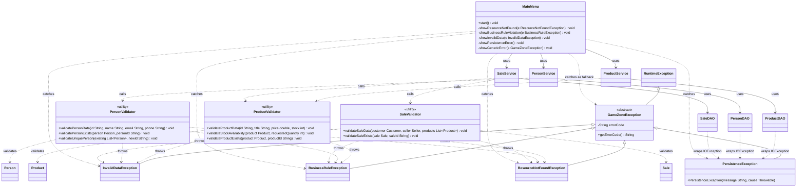

# Exception Handling and Validation - Class Diagram

```mermaid
classDiagram
    %% ===================== EXCEPTIONS (cross-cutting package) =====================
    class RuntimeException
    class GameZoneException {
        <<abstract>>
        -String errorCode
        +getErrorCode() String
    }
    class ResourceNotFoundException
    class BusinessRuleException
    class InvalidDataException
    class PersistenceException {
        +PersistenceException(message String, cause Throwable)
    }

    %% ===================== VALIDATION LAYER =====================
    class ProductValidator {
        <<utility>>
        +validateProductData(id String, title String, price double, stock int) void
        +validateStockAvailability(product Product, requestedQuantity int) void
        +validateProductExists(product Product, productId String) void
    }
    class PersonValidator {
        <<utility>>
        +validatePersonData(id String, name String, email String, phone String) void
        +validatePersonExists(person Person, personId String) void
        +validateUniquePerson(existing List~Person~, newId String) void
    }
    class SaleValidator {
        <<utility>>
        +validateSaleData(customer Customer, seller Seller, products List~Product~) void
        +validateSaleExists(sale Sale, saleId String) void
    }

    %% ===================== MODEL (for context) =====================
    class Product
    class Person
    class Sale

    %% ===================== PERSISTENCE =====================
    class ProductDAO
    class PersonDAO
    class SaleDAO

    %% ===================== SERVICE =====================
    class ProductService
    class PersonService
    class SaleService

    %% ===================== UI =====================
    class MainMenu {
        +start() void
        -showResourceNotFound(e ResourceNotFoundException) void
        -showBusinessRuleViolation(e BusinessRuleException) void
        -showInvalidData(e InvalidDataException) void
        -showPersistenceError() void
        -showGenericError(e GameZoneException) void
    }

    %% ===================== HIERARCHY =====================
    RuntimeException <|-- GameZoneException
    GameZoneException <|-- ResourceNotFoundException
    GameZoneException <|-- BusinessRuleException
    GameZoneException <|-- InvalidDataException
    GameZoneException <|-- PersistenceException

    %% ===================== VALIDATORS THROW =====================
    ProductValidator ..> InvalidDataException : throws
    ProductValidator ..> BusinessRuleException : throws
    ProductValidator ..> ResourceNotFoundException : throws
    PersonValidator ..> InvalidDataException : throws
    PersonValidator ..> BusinessRuleException : throws
    PersonValidator ..> ResourceNotFoundException : throws
    SaleValidator ..> InvalidDataException : throws
    SaleValidator ..> BusinessRuleException : throws
    SaleValidator ..> ResourceNotFoundException : throws
    ProductValidator ..> Product : validates
    PersonValidator ..> Person : validates
    SaleValidator ..> Sale : validates

    %% ===================== SERVICES CALL VALIDATORS =====================
    ProductService ..> ProductValidator : calls
    PersonService ..> PersonValidator : calls
    SaleService ..> SaleValidator : calls
    SaleService ..> ProductValidator : calls

    %% ===================== SERVICES AND PERSISTENCE =====================
    ProductService --> ProductDAO : uses
    PersonService --> PersonDAO : uses
    SaleService --> SaleDAO : uses

    %% ===================== DAOs WRAP IOException =====================
    ProductDAO ..> PersistenceException : wraps IOException
    PersonDAO ..> PersistenceException : wraps IOException
    SaleDAO ..> PersistenceException : wraps IOException

    %% ===================== UI DIFFERENTIATED HANDLING =====================
    MainMenu --> ProductService : uses
    MainMenu --> PersonService : uses
    MainMenu --> SaleService : uses
    MainMenu ..> ResourceNotFoundException : catches
    MainMenu ..> BusinessRuleException : catches
    MainMenu ..> InvalidDataException : catches
    MainMenu ..> PersistenceException : catches
    MainMenu ..> GameZoneException : catches as fallback
```