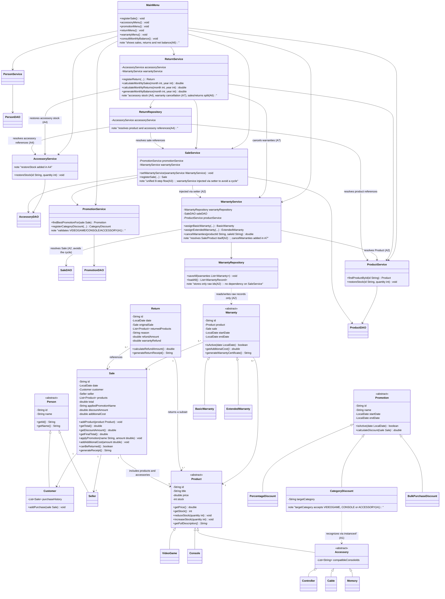

# Integrated System - Class Diagram

This diagram consolidates all four layers of the system as they exist after integrating the accessory, promotion, warranty, and return modules (A1–A7).

```mermaid
classDiagram
    %% ===================== MODEL LAYER - CORE =====================
    class Person {
        <<abstract>>
        -String id
        -String name
        +getId() String
        +getName() String
    }
    class Customer {
        -List~Sale~ purchaseHistory
        +addPurchase(sale Sale) void
    }
    class Seller
    class Product {
        <<abstract>>
        -String id
        -String title
        -double price
        -int stock
        +getPrice() double
        +getStock() int
        +reduceStock(quantity int) void
        +increaseStock(quantity int) void
        +getFullDescription()* String
    }
    class VideoGame
    class Console
    class Sale {
        -String id
        -LocalDate date
        -Customer customer
        -Seller seller
        -List~Product~ products
        -double total
        -String appliedPromotionName
        -double discountAmount
        -double additionalCost
        +addProduct(product Product) void
        +getTotal() double
        +getDiscountAmount() double
        +getFinalTotal() double
        +applyPromotion(name String, amount double) void
        +addAdditionalCost(amount double) void
        +canBeReturned() boolean
        +generateReceipt() String
    }

    %% ===================== MODEL LAYER - ACCESSORY MODULE =====================
    class Accessory {
        <<abstract>>
        -List~String~ compatibleConsoleIds
    }
    class Controller
    class Cable
    class Memory

    %% ===================== MODEL LAYER - PROMOTION MODULE =====================
    class Promotion {
        <<abstract>>
        -String id
        -String name
        -LocalDate startDate
        -LocalDate endDate
        +isActive(date LocalDate) boolean
        +calculateDiscount(sale Sale)* double
    }
    class PercentageDiscount
    class CategoryDiscount {
        -String targetCategory
        note "targetCategory accepts VIDEOGAME, CONSOLE or ACCESSORY (A1)"
    }
    class BulkPurchaseDiscount

    %% ===================== MODEL LAYER - WARRANTY MODULE =====================
    class Warranty {
        <<abstract>>
        -String id
        -Product product
        -Sale sale
        -LocalDate startDate
        -LocalDate endDate
        +isActive(date LocalDate) boolean
        +getAdditionalCost()* double
        +generateWarrantyCertificate() String
    }
    class BasicWarranty
    class ExtendedWarranty

    %% ===================== MODEL LAYER - RETURN MODULE =====================
    class Return {
        -String id
        -LocalDate date
        -Sale originalSale
        -List~Product~ returnedProducts
        -String reason
        -double refundAmount
        -double warrantyRefund
        +calculateRefundAmount() double
        +generateReturnReceipt() String
    }

    %% ===================== PERSISTENCE LAYER =====================
    class PersonDAO
    class ProductDAO
    class SaleDAO
    class AccessoryDAO
    class PromotionDAO
    class WarrantyRepository {
        +saveAll(warranties List~Warranty~) void
        +loadAll() List~WarrantyRecord~
        note "stores only raw ids (A2) - no dependency on SaleService"
    }
    class ReturnRepository {
        -AccessoryService accessoryService
        note "resolves product and accessory references (A4)"
    }

    %% ===================== SERVICE LAYER =====================
    class PersonService
    class ProductService {
        +findProductById(id String) Product
        +restoreStock(id String, quantity int) void
    }
    class AccessoryService {
        +restoreStock(id String, quantity int) void
        note "restoreStock added in A4"
    }
    class PromotionService {
        +findBestPromotionFor(sale Sale) Promotion
        +registerCategoryDiscount(...) CategoryDiscount
        note "validates VIDEOGAME/CONSOLE/ACCESSORY (A1)"
    }
    class WarrantyService {
        -WarrantyRepository warrantyRepository
        -SaleDAO saleDAO
        -ProductService productService
        +assignBasicWarranty(...) BasicWarranty
        +assignExtendedWarranty(...) ExtendedWarranty
        +cancelWarranties(productId String, saleId String) double
        note "resolves Sale/Product itself (A2); cancelWarranties added in A7"
    }
    class ReturnService {
        -AccessoryService accessoryService
        -WarrantyService warrantyService
        +registerReturn(...) Return
        +calculateMonthlySales(month int, year int) double
        +calculateMonthlyReturns(month int, year int) double
        +generateMonthlyBalance(month int, year int) double
        note "accessory stock (A4), warranty cancellation (A7), sales/returns split (A6)"
    }
    class SaleService {
        -PromotionService promotionService
        -WarrantyService warrantyService
        +setWarrantyService(warrantyService WarrantyService) void
        +registerSale(...) Sale
        note "unified 8-step flow (A3); warrantyService injected via setter to avoid a cycle"
    }

    %% ===================== UI LAYER =====================
    class MainMenu {
        +registerSale() void
        +accessoryMenu() void
        +promotionMenu() void
        +returnMenu() void
        +warrantyMenu() void
        +consultMonthlyBalance() void
        note "shows sales, returns and net balance (A6)"
    }

    %% ===================== INHERITANCE =====================
    Person <|-- Customer
    Person <|-- Seller
    Product <|-- VideoGame
    Product <|-- Console
    Product <|-- Accessory
    Accessory <|-- Controller
    Accessory <|-- Cable
    Accessory <|-- Memory
    Promotion <|-- PercentageDiscount
    Promotion <|-- CategoryDiscount
    Promotion <|-- BulkPurchaseDiscount
    Warranty <|-- BasicWarranty
    Warranty <|-- ExtendedWarranty

    %% ===================== CORE ASSOCIATIONS =====================
    Sale "1" --> "1" Customer
    Sale "1" --> "1" Seller
    Sale "1" --> "0..*" Product : includes products and accessories
    Return "0..*" --> "1" Sale : references
    Return "1" --> "1..*" Product : returns a subset
    Warranty "0..*" --> "1" Product
    Warranty "0..*" --> "1" Sale
    CategoryDiscount ..> Accessory : recognizes via instanceof (A1)

    %% ===================== PERSISTENCE DEPENDENCIES =====================
    ReturnRepository --> SaleService : resolves sale references
    ReturnRepository --> ProductService : resolves product references
    ReturnRepository --> AccessoryService : resolves accessory references (A4)
    WarrantyRepository ..> Warranty : reads/writes raw records only (A2)

    %% ===================== SERVICE DEPENDENCIES =====================
    SaleService --> PromotionService
    SaleService --> WarrantyService : injected via setter (A2)
    SaleService --> ProductDAO
    SaleService --> AccessoryDAO
    WarrantyService --> WarrantyRepository
    WarrantyService --> SaleDAO : resolves Sale (A2, avoids the cycle)
    WarrantyService --> ProductService : resolves Product (A2)
    ReturnService --> ReturnRepository
    ReturnService --> SaleService
    ReturnService --> ProductService
    ReturnService --> AccessoryService : restores accessory stock (A4)
    ReturnService --> WarrantyService : cancels warranties (A7)
    PromotionService --> PromotionDAO
    AccessoryService --> AccessoryDAO
    ProductService --> ProductDAO
    PersonService --> PersonDAO

    %% ===================== UI DEPENDENCIES =====================
    MainMenu --> PersonService
    MainMenu --> ProductService
    MainMenu --> SaleService
    MainMenu --> AccessoryService
    MainMenu --> PromotionService
    MainMenu --> ReturnService
    MainMenu --> WarrantyService
```