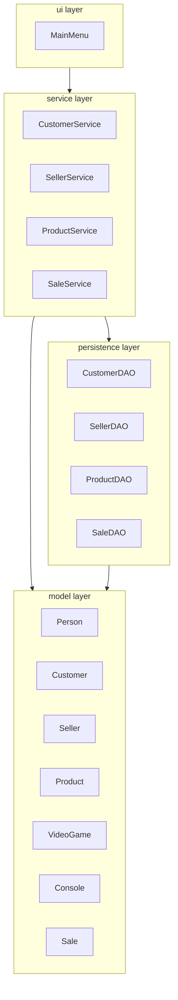

# Layers Diagram

```mermaid
graph TD
    subgraph UI["ui layer"]
        MainMenu["MainMenu"]
    end

    subgraph SERVICE["service layer"]
        CustomerService["CustomerService"]
        SellerService["SellerService"]
        ProductService["ProductService"]
        SaleService["SaleService"]
    end

    subgraph PERSISTENCE["persistence layer"]
        CustomerDAO["CustomerDAO"]
        SellerDAO["SellerDAO"]
        ProductDAO["ProductDAO"]
        SaleDAO["SaleDAO"]
    end

    subgraph MODEL["model layer"]
        Person["Person"]
        Customer["Customer"]
        Seller["Seller"]
        Product["Product"]
        VideoGame["VideoGame"]
        Console["Console"]
        Sale["Sale"]
    end

    UI --> SERVICE
    SERVICE --> MODEL
    SERVICE --> PERSISTENCE
    PERSISTENCE --> MODEL
```