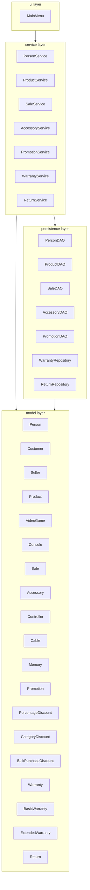

# Layers Diagram

```mermaid
graph TD
    subgraph UI["ui layer"]
        MainMenu["MainMenu"]
    end

    subgraph SERVICE["service layer"]
        PersonService["PersonService"]
        ProductService["ProductService"]
        SaleService["SaleService"]
        AccessoryService["AccessoryService"]
        PromotionService["PromotionService"]
        WarrantyService["WarrantyService"]
        ReturnService["ReturnService"]
    end

    subgraph PERSISTENCE["persistence layer"]
        PersonDAO["PersonDAO"]
        ProductDAO["ProductDAO"]
        SaleDAO["SaleDAO"]
        AccessoryDAO["AccessoryDAO"]
        PromotionDAO["PromotionDAO"]
        WarrantyRepository["WarrantyRepository"]
        ReturnRepository["ReturnRepository"]
    end

    subgraph MODEL["model layer"]
        Person["Person"]
        Customer["Customer"]
        Seller["Seller"]
        Product["Product"]
        VideoGame["VideoGame"]
        Console["Console"]
        Sale["Sale"]
        Accessory["Accessory"]
        Controller["Controller"]
        Cable["Cable"]
        Memory["Memory"]
        Promotion["Promotion"]
        PercentageDiscount["PercentageDiscount"]
        CategoryDiscount["CategoryDiscount"]
        BulkPurchaseDiscount["BulkPurchaseDiscount"]
        Warranty["Warranty"]
        BasicWarranty["BasicWarranty"]
        ExtendedWarranty["ExtendedWarranty"]
        Return["Return"]
    end

    UI --> SERVICE
    SERVICE --> MODEL
    SERVICE --> PERSISTENCE
    PERSISTENCE --> MODEL
```