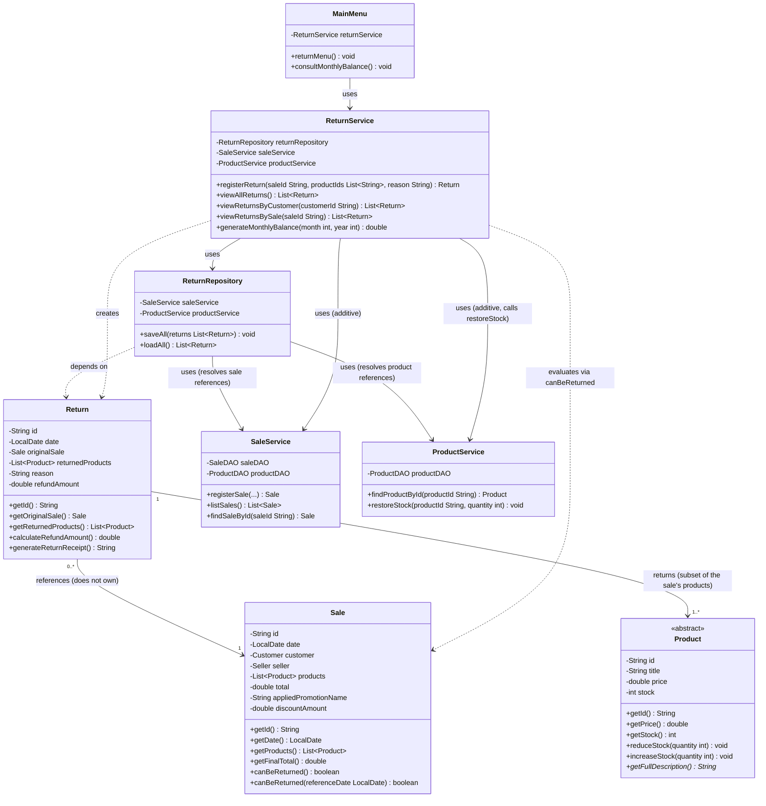

# Return Module - Class Diagram

```mermaid
classDiagram
    %% ===================== EXISTING MODEL LAYER (for context) =====================
    class Product {
        <<abstract>>
        -String id
        -String title
        -double price
        -int stock
        +getId() String
        +getPrice() double
        +getStock() int
        +reduceStock(quantity int) void
        +increaseStock(quantity int) void
        +getFullDescription()* String
    }

    class Sale {
        -String id
        -LocalDate date
        -Customer customer
        -Seller seller
        -List~Product~ products
        -double total
        -String appliedPromotionName
        -double discountAmount
        +getId() String
        +getDate() LocalDate
        +getProducts() List~Product~
        +getFinalTotal() double
        +canBeReturned() boolean
        +canBeReturned(referenceDate LocalDate) boolean
    }

    %% ===================== NEW MODEL LAYER =====================
    class Return {
        -String id
        -LocalDate date
        -Sale originalSale
        -List~Product~ returnedProducts
        -String reason
        -double refundAmount
        +getId() String
        +getOriginalSale() Sale
        +getReturnedProducts() List~Product~
        +calculateRefundAmount() double
        +generateReturnReceipt() String
    }

    %% ===================== NEW PERSISTENCE LAYER =====================
    class ReturnRepository {
        -SaleService saleService
        -ProductService productService
        +saveAll(returns List~Return~) void
        +loadAll() List~Return~
    }

    %% ===================== NEW SERVICE LAYER =====================
    class ReturnService {
        -ReturnRepository returnRepository
        -SaleService saleService
        -ProductService productService
        +registerReturn(saleId String, productIds List~String~, reason String) Return
        +viewAllReturns() List~Return~
        +viewReturnsByCustomer(customerId String) List~Return~
        +viewReturnsBySale(saleId String) List~Return~
        +generateMonthlyBalance(month int, year int) double
    }

    %% ===================== EXISTING SERVICE LAYER (for context) =====================
    class SaleService {
        -SaleDAO saleDAO
        -ProductDAO productDAO
        +registerSale(...) Sale
        +listSales() List~Sale~
        +findSaleById(saleId String) Sale
    }

    class ProductService {
        -ProductDAO productDAO
        +findProductById(productId String) Product
        +restoreStock(productId String, quantity int) void
    }

    class MainMenu {
        -ReturnService returnService
        +returnMenu() void
        +consultMonthlyBalance() void
    }

    %% ===================== RELATIONSHIPS =====================
    Return "0..*" --> "1" Sale : references (does not own)
    Return "1" --> "1..*" Product : returns (subset of the sale's products)

    ReturnRepository ..> Return : depends on
    ReturnRepository --> SaleService : uses (resolves sale references)
    ReturnRepository --> ProductService : uses (resolves product references)

    ReturnService --> ReturnRepository : uses
    ReturnService --> SaleService : uses (additive)
    ReturnService --> ProductService : uses (additive, calls restoreStock)
    ReturnService ..> Return : creates
    ReturnService ..> Sale : evaluates via canBeReturned

    MainMenu --> ReturnService : uses
```