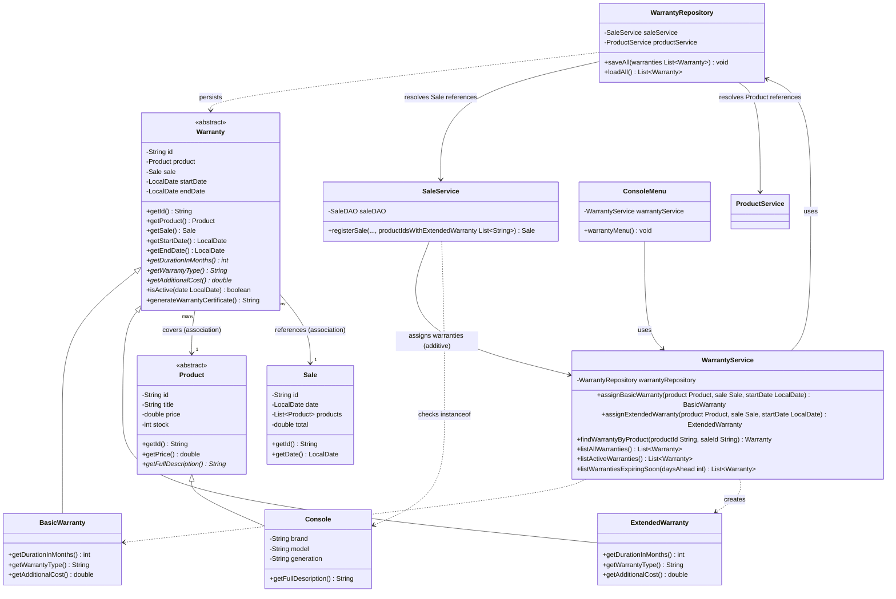

# Warranty Module - Class Diagram

```mermaid
classDiagram
    %% ===================== EXISTING MODEL LAYER (for context) =====================
    class Product {
        <<abstract>>
        -String id
        -String title
        -double price
        -int stock
        +getId() String
        +getPrice() double
        +getFullDescription()* String
    }

    class Console {
        -String brand
        -String model
        -String generation
        +getFullDescription() String
    }

    class Sale {
        -String id
        -LocalDate date
        -List~Product~ products
        -double total
        +getId() String
        +getDate() LocalDate
    }

    %% ===================== NEW MODEL LAYER =====================
    class Warranty {
        <<abstract>>
        -String id
        -Product product
        -Sale sale
        -LocalDate startDate
        -LocalDate endDate
        +getId() String
        +getProduct() Product
        +getSale() Sale
        +getStartDate() LocalDate
        +getEndDate() LocalDate
        +getDurationInMonths()* int
        +getWarrantyType()* String
        +getAdditionalCost()* double
        +isActive(date LocalDate) boolean
        +generateWarrantyCertificate() String
    }

    class BasicWarranty {
        +getDurationInMonths() int
        +getWarrantyType() String
        +getAdditionalCost() double
    }

    class ExtendedWarranty {
        +getDurationInMonths() int
        +getWarrantyType() String
        +getAdditionalCost() double
    }

    %% ===================== NEW PERSISTENCE LAYER =====================
    class WarrantyRepository {
        -SaleService saleService
        -ProductService productService
        +saveAll(warranties List~Warranty~) void
        +loadAll() List~Warranty~
    }

    %% ===================== NEW SERVICE LAYER =====================
    class WarrantyService {
        -WarrantyRepository warrantyRepository
        +assignBasicWarranty(product Product, sale Sale, startDate LocalDate) BasicWarranty
        +assignExtendedWarranty(product Product, sale Sale, startDate LocalDate) ExtendedWarranty
        +findWarrantyByProduct(productId String, saleId String) Warranty
        +listAllWarranties() List~Warranty~
        +listActiveWarranties() List~Warranty~
        +listWarrantiesExpiringSoon(daysAhead int) List~Warranty~
    }

    %% ===================== EXISTING SERVICE LAYER (for context) =====================
    class SaleService {
        -SaleDAO saleDAO
        +registerSale(..., productIdsWithExtendedWarranty List~String~) Sale
    }

    class ConsoleMenu {
        -WarrantyService warrantyService
        +warrantyMenu() void
    }

    %% ===================== RELATIONSHIPS =====================
    Product <|-- Console
    Warranty <|-- BasicWarranty
    Warranty <|-- ExtendedWarranty

    Warranty "many" --> "1" Product : covers (association)
    Warranty "many" --> "1" Sale : references (association)

    WarrantyRepository ..> Warranty : persists
    WarrantyRepository --> SaleService : resolves Sale references
    WarrantyRepository --> ProductService : resolves Product references

    WarrantyService --> WarrantyRepository : uses
    WarrantyService ..> BasicWarranty : creates
    WarrantyService ..> ExtendedWarranty : creates

    SaleService --> WarrantyService : assigns warranties (additive)
    SaleService ..> Console : checks instanceof

    ConsoleMenu --> WarrantyService : uses
```